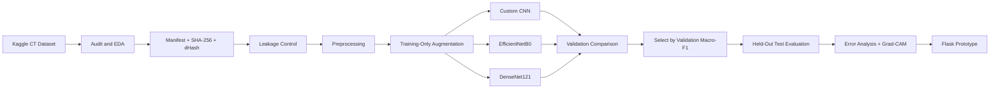
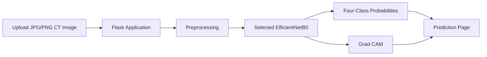

# Explainable Deep Learning for Multiclass Lung Cancer Classification Using Chest CT Images


## Project Overview

This repository contains the implementation and supporting artefacts for the MSc Data Science and Artificial Intelligence research project:

**Explainable Deep Learning for Multiclass Lung Cancer Classification Using Chest CT Images**

The project develops and critically evaluates a leakage-aware deep-learning pipeline for classifying chest CT images into four categories:

- Normal
- Adenocarcinoma
- Large Cell Carcinoma
- Squamous Cell Carcinoma

The work focuses on dataset quality, duplicate leakage, class imbalance, reproducible preprocessing, model comparison, held-out test evaluation, Grad-CAM explainability, confidence/error analysis and a local Flask prototype.

> **Important:** This is an academic prototype only. It is **not** a clinical diagnostic system and must not be used for diagnosis or treatment decisions.

---

## Research Question

> To what extent can an explainable, leakage-aware deep-learning pipeline reliably classify chest CT images into Normal, adenocarcinoma, large-cell carcinoma and squamous-cell carcinoma categories?

## Aim

To design, implement and critically evaluate an explainable deep-learning pipeline for four-class chest CT classification using licensed secondary data, with attention to data quality, leakage, balanced performance and interpretability.

## Objectives

**O1)** Audit the dataset for image quality, class balance, dimensions and duplicate leakage.  
**O2)** Build a reproducible preprocessing and training pipeline.  
**O3)** Compare a Custom CNN, EfficientNetB0 and DenseNet121.  
**O4)** Select the best model using validation macro-F1 and evaluate it once on the held-out test set.  
**O5)** Use error analysis, ROC/PR curves and Grad-CAM to interpret model behaviour.  
**O6)** Integrate the selected model into a local Flask prototype.

---

## Dataset

The project uses the public **Chest CT-Scan Images** dataset by **Mohamed Hany** on Kaggle.

**Dataset link:**  
https://www.kaggle.com/datasets/mohamedhanyyy/chest-ctscan-images

### Dataset Classes

| Class | Description |
|---|---|
| Normal | Normal CT images |
| Adenocarcinoma | Lung adenocarcinoma |
| Large Cell Carcinoma | Large-cell carcinoma |
| Squamous Cell Carcinoma | Squamous-cell lung carcinoma |

### Original Dataset Split

| Split | Images |
|---|---:|
| Train | 613 |
| Validation | 72 |
| Test | 315 |
| **Total** | **1,000** |

### Licence

The dataset is reused under the **Open Data Commons Open Database License (ODbL) v1.0**:

https://opendatacommons.org/licenses/odbl/1-0/

Only secondary data are used.

---

## Data Quality and Leakage Audit

Before model development, the dataset was audited for:

- image readability
- class distribution
- image dimensions
- file size
- mean pixel intensity
- SHA-256 hashes
- perceptual dHash similarity
- exact duplicate groups
- cross-split duplication
- possible near-duplicate pairs

### Key Audit Findings

- **59 exact duplicate groups** were identified.
- **22 duplicate groups crossed dataset splits.**
- **153 repeated copies** were removed.
- **847 unique-by-content images** remained for leakage-controlled modelling.
- The Normal class became relatively small after deduplication.
- Patient-level independence could not be verified because patient identifiers were unavailable.

---

## High-Level Architecture



---

## Preprocessing Pipeline

The preprocessing pipeline included:

1. dataset manifest creation
2. image integrity checks
3. exact duplicate detection using SHA-256
4. perceptual similarity screening using dHash
5. deterministic leakage control
6. image resizing to **224 × 224**
7. RGB conversion
8. balanced class weighting
9. conservative training-only augmentation
10. strict validation/test isolation

### Training-Only Augmentation

- horizontal flipping
- small rotation
- small translation
- small zoom
- mild contrast adjustment

---

## Models

| Model | Approx. Parameters | Purpose |
|---|---:|---|
| Custom CNN | 0.28M | Baseline trained from scratch |
| EfficientNetB0 | 4.41M | Lightweight transfer-learning model |
| DenseNet121 | 7.33M | Deeper transfer-learning comparator |

### Why These Models?

**Custom CNN** provides a simple baseline and shows how a model trained from scratch behaves on this dataset.

**EfficientNetB0** provides a strong balance between transfer-learning performance and model size.

**DenseNet121** provides a deeper comparator with dense feature reuse.

---

## Training Configuration

- Input size: `224 x 224 x 3`
- Output: 4-class softmax
- Optimizer: Adam
- Loss: categorical cross-entropy with label smoothing
- Class imbalance strategy: balanced class weights
- Regularisation: dropout
- Early stopping
- ReduceLROnPlateau
- Model checkpointing
- ImageNet-pretrained weights for transfer-learning models

---

## Validation Model Comparison

| Model | Validation Macro-F1 | Interpretation |
|---|---:|---|
| Custom CNN | 0.097 | Failed to generalise |
| DenseNet121 | 0.659 | Strong transfer-learning improvement |
| **EfficientNetB0** | **0.743** | **Selected model** |

The final model was selected using **validation macro-F1** before the held-out test set was evaluated.

---

## Held-Out Test Results

| Metric | Result |
|---|---:|
| Accuracy | **78.07%** |
| Balanced Accuracy | **79.89%** |
| Macro-F1 | **81.31%** |
| Macro One-vs-Rest ROC-AUC | **92.68%** |
| Correct predictions | **210 / 269** |

### Main Error Pattern

The most frequent misclassification was:

**Squamous Cell Carcinoma → Adenocarcinoma**

This occurred in **25 of 90 squamous-cell test images**.

---

## Evaluation Metrics

The project uses:

- Accuracy
- Precision
- Recall / Sensitivity
- Specificity
- F1-Score
- Macro-F1
- Balanced Accuracy
- ROC-AUC
- PR-AUC
- Confusion Matrix

Accuracy alone was not sufficient because the classes were imbalanced.

---

## Grad-CAM Explainability

Grad-CAM was used to inspect which regions of a CT image influenced the final model's prediction.

The method:

1. extracts convolutional feature maps
2. calculates gradients for the predicted class
3. weights the feature maps using those gradients
4. produces a heatmap
5. overlays the heatmap on the original CT image

Grad-CAM supports model inspection, but it does **not** prove clinical tumour localisation.

---

## Confidence and Error Analysis

The project compares prediction confidence for correct and incorrect predictions.

The distributions overlap, demonstrating that:

> **High softmax confidence does not guarantee a correct prediction.**

Softmax scores are therefore treated as model confidence values, not calibrated clinical probabilities.

---

## Flask Prototype

A local Flask application was created to demonstrate model inference.



The prototype can display:

- uploaded CT image
- predicted class
- probabilities for all four classes
- Grad-CAM overlay
- non-clinical disclaimer

---

## Repository Structure

Based on the current repository layout:

```text
explainable-lung-cancer-classification/
│
├── Notebook/
├── figures/
├── flask app/
├── model/
├── README.md
├── class_names.json
├── model_metadata.json
└── selected_model.keras.txt
```

Research artefacts generated by the pipeline include manifests, audit reports, training histories, validation comparisons and final test predictions.

---

## Software and Libraries

| Tool / Library | Role |
|---|---|
| Python | Core programming language |
| Kaggle | Dataset hosting and GPU notebook execution |
| TensorFlow / Keras | CNNs, transfer learning and model export |
| scikit-learn | Class weights and evaluation metrics |
| NumPy | Numerical operations |
| Pandas | Manifests and analysis tables |
| Matplotlib | EDA and result visualisation |
| Pillow | Image handling |
| Flask | Local web prototype |
| Git / GitHub | Version control and traceability |

---

## Running the Project

### 1. Clone the Repository

```bash
git clone https://github.com/Nagasai-10/explainable-lung-cancer-classification.git
cd explainable-lung-cancer-classification
```

### 2. Create a Virtual Environment

```bash
python -m venv venv
```

### 3. Activate the Environment

**Windows**

```bash
venv\Scripts\activate
```

**macOS / Linux**

```bash
source venv/bin/activate
```

### 4. Install Dependencies

```bash
pip install tensorflow flask numpy pandas scikit-learn matplotlib pillow
```

### 5. Download the Dataset

https://www.kaggle.com/datasets/mohamedhanyyy/chest-ctscan-images

### 6. Run the Notebook

Open the project notebook inside the `Notebook/` directory using Kaggle, Jupyter Notebook or JupyterLab.

### 7. Run the Flask Prototype

```bash
cd "flask app"
python app.py
```

Then open the local address shown in the terminal, commonly:

```text
http://127.0.0.1:5000
```

---

## Limitations

- relatively small public dataset
- substantial duplicate structure in the original data
- reduced Normal-class support after deduplication
- possible source artefacts
- no patient identifiers
- patient-level independence cannot be verified
- residual near-duplicate uncertainty
- no independent external validation dataset
- no clinical validation
- no clinician or participant evaluation under the current UREC1 scope
- Grad-CAM does not establish clinical localisation
- softmax confidence is not a calibrated clinical probability

---

## Future Work

Potential extensions include:

- larger DICOM-based datasets
- patient-level train/validation/test splits
- independent external validation
- repeated random seeds
- cross-validation
- probability calibration
- additional model architectures
- comparison with other explainability methods
- improved CT intensity/window standardisation
- expert evaluation after appropriate ethics approval

---

## Ethics and Responsible Use

This project uses **secondary data only**.

No participants, interviews, surveys, new CT scans, identifiable medical records or treatment recommendations were included.

The prototype is intended only for academic demonstration.

---

## GitHub Repository

https://github.com/Nagasai-10/explainable-lung-cancer-classification

---

## Author

**Nagasai Banothu**  
MSc Data Science and Artificial Intelligence  
Sheffield Hallam University  
Student ID: **35040393**

---

## Academic Disclaimer

This model and Flask application are **not medical devices** and must not be used for diagnosis, treatment, triage or clinical decision-making.

---

## Final Project Summary

The project demonstrates that transfer learning can provide useful four-class discrimination on the selected chest CT dataset. EfficientNetB0 achieved the strongest validation performance and a held-out test macro-F1 of **81.31%**.

The project also shows that **data quality matters as much as model choice**. Duplicate leakage, class imbalance, source artefacts and missing patient-level information materially affect how performance should be interpreted.

> **Final conclusion:** The model is a useful academic prototype, but the current evidence is not sufficient for clinical generalisation.
